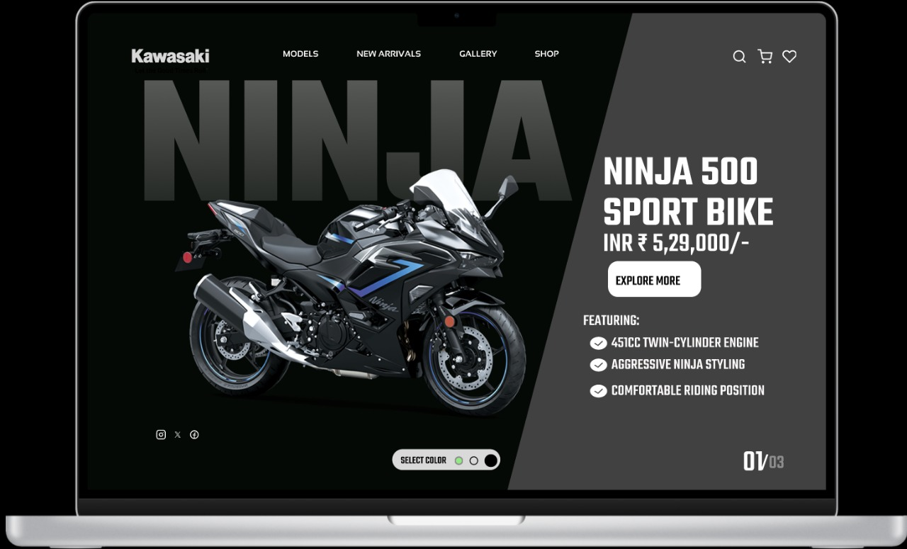

# figma_projects
# Kawasaki Ninja 500 – Figma UI Design

A sleek and modern landing page UI concept for the *Kawasaki Ninja 500 Sport Bike, created using **Figma*. This design emphasizes bold visuals, a clean layout, and a focus on product presentation, suitable for a bike manufacturer's website or e-commerce platform.

---

## 🔥 Preview

> 📁 Note: Add your actual image paths in place of the placeholders above.

---

## 📌 Key Features

- ✅ *Modern Hero Section* with dynamic bike imagery
- ✅ *Multiple Color Variants* – Silver, Black, and Signature Green
- ✅ *Specifications Highlight* – Engine type, styling, comfort
- ✅ *E-commerce Ready* – Pricing, Explore button, icons for wishlist/cart
- ✅ *Minimal UI* – Clean layout with emphasis on product

---

## 🛠 Tools Used

- [Figma](https://www.figma.com/) – UI Design and Prototyping

---

## 📂 Project Structure

📁 kawasaki-ninja-figma-design/
├── images/ # Screenshots of the UI designs
├── README.md # Project overview and documentation
└── [Figma File Link] # (Optional) Public Figma link

---

## 🌐 Live Preview / Figma File

If you're sharing the Figma file publicly:

[Figma File – View Project]([https://www.figma.com/file/your-file-link-here](https://www.figma.com/design/x9pn3IIXgwZoBvqTWdfPUc/Untitled?node-id=0-1&t=M5rV5KzZ6UUHIzOz-1))

---

## 📣 Author

*Your Name*  
[GitHub](https://github.com/yourusername) • [LinkedIn](www.linkedin.com/in/amrith-anil-954685240)

---

## 📄 License

This design is for educational and personal portfolio use. Commercial use requires permission.
